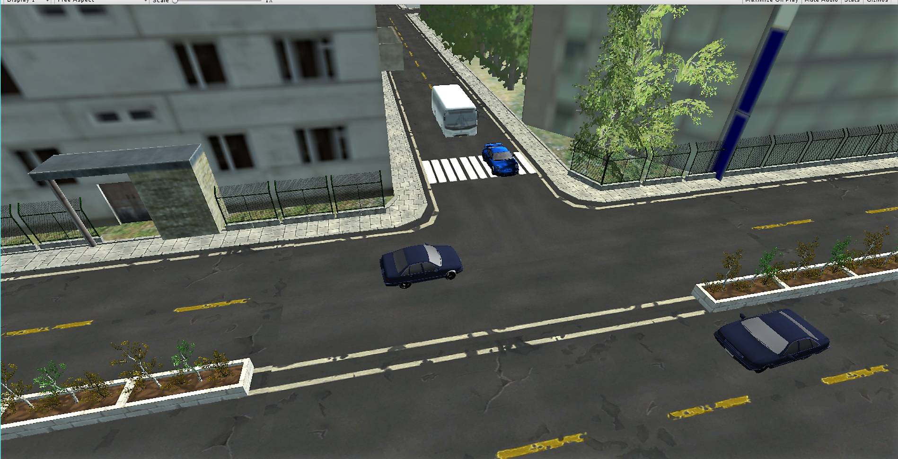

# Car-simulator
This simulation uses various Algorithms for cars in environmnet to create mixed traffic scenarios.

You are able to experience the real-time view of the car. For the people who don’t know how to drive,this simulation is the best example for those to learn driving and can be used for generating reaction time for different users while driving. AI simulator is mounted with VR connectivity which allows immersive experience in 360 view.   

# Tools: Unity3D, blender, android sdk 
